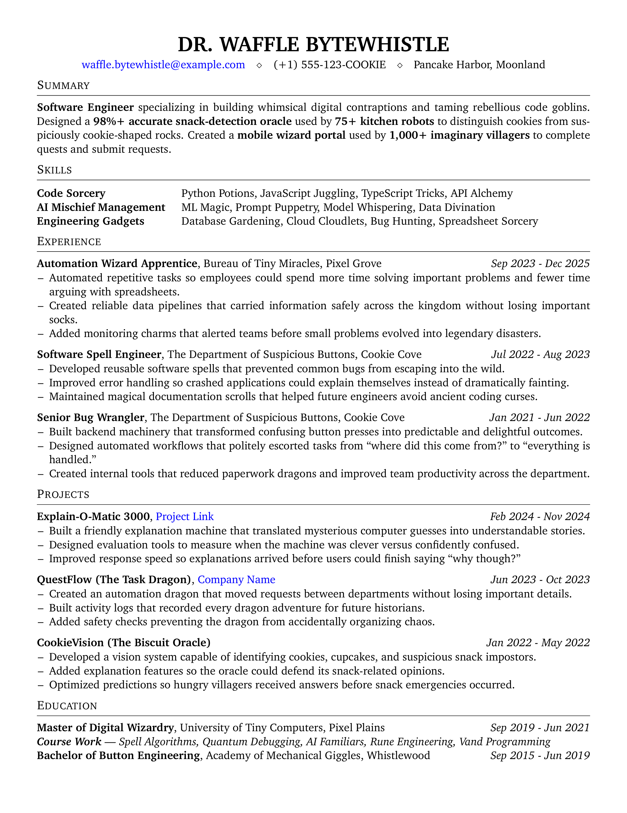

# ResumeTex

A modular, data-driven LaTeX resume framework designed to make customization simple.

    

[🐛 Report Bug](https://github.com/harshkaso/resumetex/issues) · [✨ Request Feature](https://github.com/harshkaso/resumetex/issues) · [🤝 Contribute](https://github.com/harshkaso/resumetex/blob/main/CONTRIBUTING.md)

[<kbd>  Edit Resume on Overleaf  </kbd>](https://www.overleaf.com/docs?snip_uri=https://github.com/harshkaso/resumetex/archive/refs/heads/main.zip)

---

## Why ResumeTeX?

Most LaTeX resume templates are difficult to customize.

Content, layout, and formatting are often tightly coupled, so making even simple changes—like reordering sections, adding a new project, or updating contact information—means digging through large blocks of LaTeX and hoping you don't break the layout.

**ResumeTeX** was built to solve that problem.

Instead of editing the document structure directly, you define your resume using simple data commands, while the template takes care of the presentation.

### What makes it different?

- 📝 **Content and layout are separated.** Update your resume data without touching the formatting.
- 🔄 **Reorder sections effortlessly.** Change the order of your resume by simply rearranging the `\Print...` commands.
- 📦 **Reusable data commands.** Add experiences, projects, education, and skills through clean, self-contained commands.
- 🎨 **Layout-focused customization.** Modify the appearance without rewriting your resume content.
- ☁️ **Overleaf-friendly.** Open the template directly in Overleaf or compile it locally with any standard LaTeX distribution.

---

## Philosophy

ResumeTeX treats your resume like a small application:

- **Data** → Your personal information, experience, projects, and education.
- **Layout** → How that information is presented.
- **Rendering** → The template combines both to generate your PDF.

This separation makes the template easier to understand, easier to maintain, and much easier to customize than traditional LaTeX resumes.