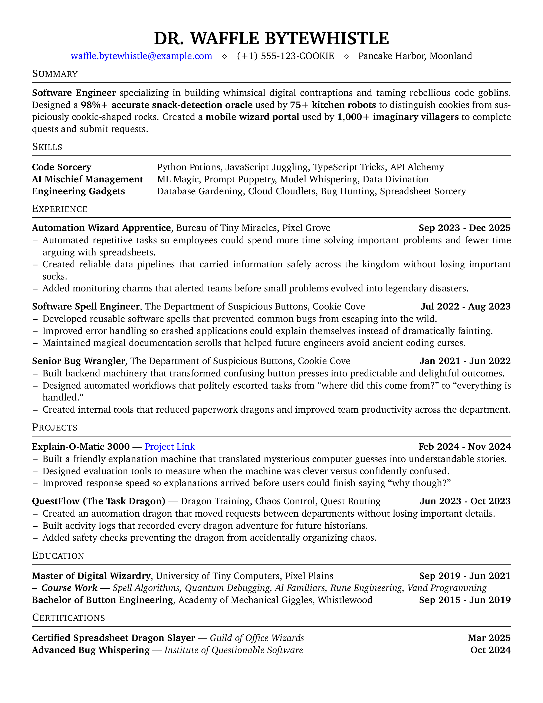

<div align="center">

# ResumeTex

<p align="center">A modular, data-driven LaTeX resume framework designed to make customization simple.</p>

[](https://github.com/harshkaso/resumetex/stargazers) [](https://github.com/harshkaso/resumetex/network) [](https://github.com/harshkaso/resumetex/issues) [](https://github.com/harshkaso/resumetex/watchers) [](https://opensource.org/licenses/MIT)


[🐛 Report Bug](https://github.com/harshkaso/resumetex/issues) · [✨ Request Feature](https://github.com/harshkaso/resumetex/issues) · [🤝 Contribute](https://github.com/harshkaso/resumetex/blob/main/CONTRIBUTING.md)

</div>


<div align="center">

[](https://www.overleaf.com/docs?snip_uri=https://github.com/harshkaso/resumetex/archive/refs/heads/main.zip&snip_name=ResumeTex)

</div>



---

## Why ResumeTeX?

Most LaTeX resume templates are difficult to customize.

Content, layout, and formatting are often tightly coupled, so making even simple changes—like reordering sections, adding a new project, or updating contact information—means digging through large blocks of LaTeX and hoping you don't break the layout.

**ResumeTeX** was built to solve that problem.

Instead of editing the document structure directly, you define your resume using simple data commands, while the template takes care of the presentation.

### What makes it different?

- **Content and layout are separated.** Update your resume data without touching the formatting.
- **Reorder sections effortlessly.** Change the order of your resume by simply rearranging the `\Print...` commands.
- **Reusable data commands.** Add experiences, projects, education, and skills through clean, self-contained commands.
- **Layout-focused customization.** Modify the appearance without rewriting your resume content.
- **Overleaf-friendly.** Open the template directly in Overleaf or compile it locally with any standard LaTeX distribution.

---

## Philosophy

ResumeTeX treats your resume like a small application:

- **Data** → Your personal information, experience, projects, and education.
- **Layout** → How that information is presented.
- **Rendering** → The template combines both to generate your PDF.

This separation makes the template easier to understand, easier to maintain, and much easier to customize than traditional LaTeX resumes.

---

## Tutorial / How to Use

ResumeTeX separates your resume into two parts:

1. **Data** — the content of your resume.
2. **Layout** — the order and structure used to render that content.

You primarily work with the data commands. The template handles the formatting for you.

### 1. Contact Information

Use `\SetContact` to define your name and contact information.

```latex
\SetContact
    {John Doe}
    {\href{mailto:john@example.com}{john@example.com}}
    {+1 416-555-1234}
    {Toronto, Canada}

```

Arguments:

| Argument | Description  |
| -------- | ------------ |
| `#1`     | Name         |
| `#2`     | Email        |
| `#3`     | Phone number |
| `#4`     | Location     |

The contact information is rendered automatically at the top of the resume.

### 2. Professional Summary

Use `\SetProfessionalSummary` to define your professional summary.

```latex
\SetProfessionalSummary{
    Software Engineer specializing in Python, backend development, and building scalable applications.
}
```
The argument can contain normal LaTeX commands, so you can use formatting such as:
```latex
\SetProfessionalSummary{
    \textbf{Software Engineer} specializing in Python and \textbf{backend development}.
}
```

### 3. Skills

Add skills using `\AddSkill`.
```latex
\AddSkill
    {Programming Languages}
    {Python, Java, C++, TypeScript}

\AddSkill
    {Frameworks}
    {Django, Flask, React, Node.js}

\AddSkill
    {Tools}
    {Git, Docker, AWS}
```

Arguments:

| Argument | Description            |
| -------- | ---------------------- |
| `#1`     | Skill category         |
| `#2`     | Comma-separated skills |

Each call creates one row in the Skills section.

You can add as many skill categories as needed.

### 4. Experience

Use `\AddExperience` to add a work experience entry.

```latex
\AddExperience
    {Software Engineer}
    {Example Company}
    {Toronto, Canada}
    {Jan 2024}
    {Present}
    {
        \item[--] Built backend services using Python and Django.
        \item[--] Improved application performance by 35\%.
        \item[--] Designed automated deployment workflows.
    }
```

Arguments:

| Argument | Description     |
| -------- | --------------- |
| `#1`     | Job title       |
| `#2`     | Company         |
| `#3`     | Location        |
| `#4`     | Start date      |
| `#5`     | End date        |
| `#6`     | Accomplishments |

Accomplishments use standard `\item` commands:

```latex
{
    \item[--] First accomplishment.
    \item[--] Second accomplishment.
    \item[--] Third accomplishment.
}
```

#### Start an Entry on a New Page
The starred version forces the entry to begin on a new page:
```latex
\AddExperience*
    {Software Engineer}
    {Example Company}
    {Toronto, Canada}
    {Jan 2024}
    {Present}
    {
        \item[--] Built backend services.
        \item[--] Improved application performance.
    }
```

The `*` works independently for each entry, so you can decide exactly where a page break should occur.

### 5. Projects

Use `\AddProject` to add a project entry.

```latex
\AddProject
    {My Awesome Project}
    {Jan 2024}
    {Mar 2024}
    {
        \item[--] Built a real-time data processing pipeline.
        \item[--] Processed more than 1 million records.
        \item[--] Added automated testing and deployment.
    }
```

Arguments:

| Argument | Description                       |
| -------- | --------------------------------- |
| `#1`     | Project name                      |
| `#2`     | Start date                        |
| `#3`     | End date                          |
| `#4`     | Accomplishments                   |
| `#5`     | Additional information (optional) |

The optional fifth argument can be used for a project link, technology list, company name, or other short information.

For example:

```latex
\AddProject
    {Flux}
    {Jan 2024}
    {Feb 2024}
    {
        \item[--] Built a real-time particle-flowfield visualization.
        \item[--] Supported 15,000 particles at 30 FPS.
    }
    [Python, NumPy, DearPyGui]
```

Or use it for a link:

```latex
\AddProject
    {My Portfolio}
    {Jan 2024}
    {Mar 2024}
    {
        \item[--] Built a personal portfolio website.
    }
    [\href{https://example.com}{Project Link}]
```

Like Experience, the starred version starts the project on a new page:

```latex
\AddProject*
    {My Project}
    {Jan 2024}
    {Mar 2024}
    {
        \item[--] Built something interesting.
    }
```

### 6. Education

Use `\AddEducation` to add an education entry.

```latex
\AddEducation
    {Master of Science in Computer Science}
    {University of Example}
    {Toronto, Canada}
    {2022}
    {2024}
```

Arguments:

| Argument | Description            |
| -------- | ---------------------- |
| `#1`     | Degree                 |
| `#2`     | University / School    |
| `#3`     | Location               |
| `#4`     | Start date             |
| `#5`     | End date               |
| `#6`     | Course work (optional) |

Course work can be added as an optional argument:

```latex
\AddEducation
    {Master of Science in Computer Science}
    {University of Example}
    {Toronto, Canada}
    {2022}
    {2024}
    [Algorithms, Distributed Systems, Machine Learning, Databases]
```

When course work is provided, it is rendered underneath the education entry.

The starred version starts the entry on a new page:

```latex
\AddEducation*
    {Master of Science in Computer Science}
    {University of Example}
    {Toronto, Canada}
    {2022}
    {2024}
```

### 7. Certification

Use `\AddCertification` to add a certification entry

```latex
\AddCertification
    {AWS Certified Developer}
    {Amazon Web Services}
    {Mar 2025}
```
Arguments:

| Argument | Description          |
| -------- | -------------------- |
| `#1`     | Certification name   |
| `#2`     | Issuing organization |
| `#3`     | Date earned          |

Multiple certifications can be added by calling the command repeatedly:

```latex
\AddCertification
    {AWS Certified Developer}
    {Amazon Web Services}
    {Mar 2025}

\AddCertification
    {Professional Scrum Master}
    {Scrum.org}
    {Jan 2025}
```

Use the starred version to start a certification on a new page:

```latex
\AddCertification*
    {AWS Certified Developer}
    {Amazon Web Services}
    {Mar 2025}
```

### Reordering Section

The order of sections is controlled by the `\Print...` commands near the end of the document.

For example:

```latex
\begin{document}

\PrintContact
\PrintSummary
\PrintSkills
\PrintExperiences
\PrintProjects
\PrintEducation
\PrintCertifications

\end{document}
```

To put Education before Projects, simply change the order:

```latex
\begin{document}

\PrintContact
\PrintSummary
\PrintSkills
\PrintExperiences
\PrintEducation
\PrintProjects
\PrintCertifications

\end{document}
```

You do not need to modify the section definitions or any of the data commands.

### Adding Multiple Entries

There is no separate list to maintain. Simply call the appropriate command once for each entry.

```latex
\AddExperience
    {Software Engineer}
    {Company A}
    {Toronto, Canada}
    {2024}
    {Present}
    {
        \item[--] Built software.
    }

\AddExperience
    {Junior Developer}
    {Company B}
    {Toronto, Canada}
    {2022}
    {2024}
    {
        \item[--] Developed applications.
    }
```

ResumeTeX automatically combines the entries into the corresponding section.

## Quick Reference

| Command                        | Purpose                             |
| ------------------------------ | ----------------------------------- |
| `\SetContact{...}`             | Set contact information             |
| `\SetProfessionalSummary{...}` | Set professional summary            |
| `\AddSkill{...}{...}`          | Add a skill category                |
| `\AddExperience{...}`          | Add work experience                 |
| `\AddExperience*{...}`         | Add experience with a page break    |
| `\AddProject{...}`             | Add a project                       |
| `\AddProject*{...}`            | Add project with a page break       |
| `\AddEducation{...}`           | Add education                       |
| `\AddEducation*{...}`          | Add education with a page break     |
| `\AddCertification{...}`       | Add certification                   |
| `\AddCertification*{...}`      | Add certification with a page break |
| `\PrintContact`                | Render contact information          |
| `\PrintSummary`                | Render summary                      |
| `\PrintSkills`                 | Render skills                       |
| `\PrintExperiences`            | Render experience                   |
| `\PrintProjects`               | Render projects                     |
| `\PrintEducation`              | Render education                    |
| `\PrintCertifications`         | Render certifications               |

## Typical Workflow

For normal resume editing, you only need to modify the Data section:

```latex
% Contact
\SetContact{...}

% Summary
\SetProfessionalSummary{...}

% Skills
\AddSkill{...}{...}

% Experience
\AddExperience{...}

% Projects
\AddProject{...}

% Education
\AddEducation{...}

% Certifications
\AddCertification{...}
```

The layout and rendering logic can remain unchanged.